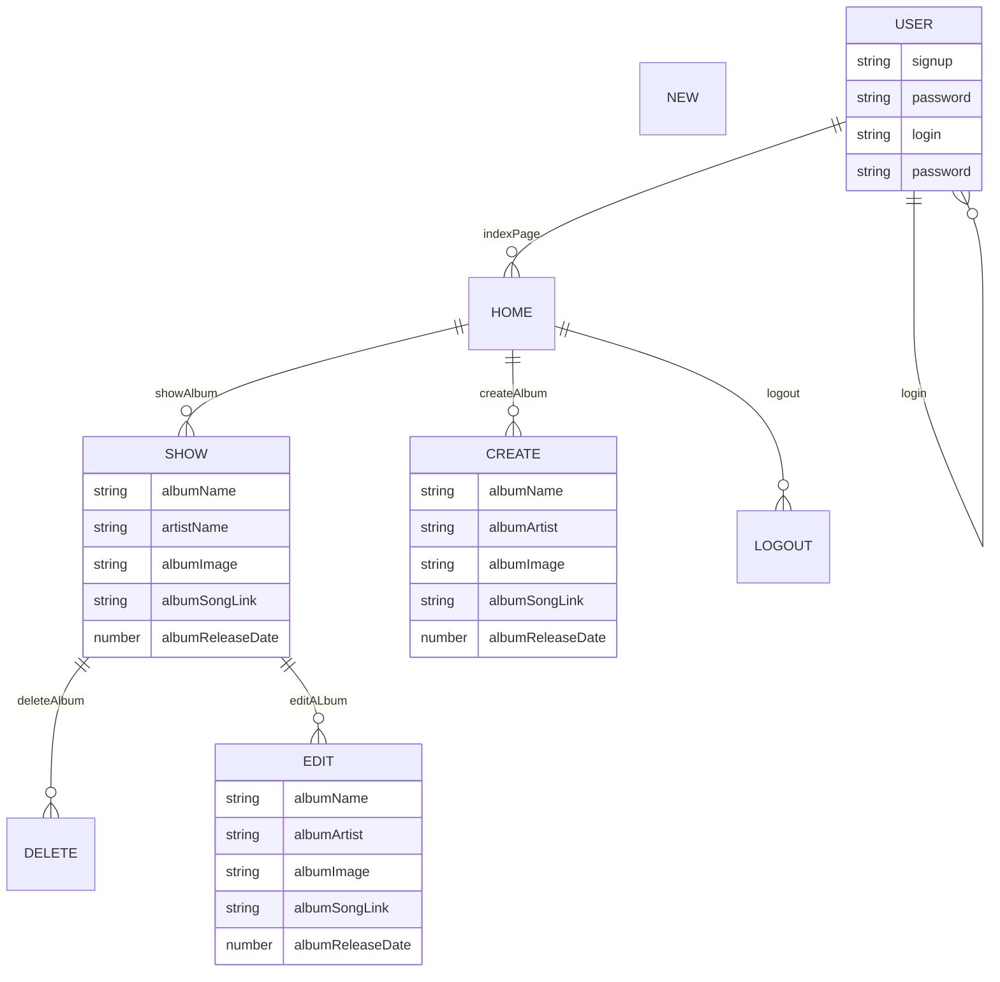

# Project 3 Backend 

- **Project Name:** Personal JukeBox
- **Project By:** Jonathan Casasola, Michael Delvecchio, Adrian Garcia 
- [**Link To  Frontend GITHUB**](https://github.com/Jonathan1295-09/Project_3Frontend)
- [**LINK TO DEPLOYED WEBSITE**]
- **List of technologies used** Mongoose, morgan, express, cors, dotenv 
- [**Link to Trello**](https://trello.com/b/pHLyMGtB/project-3)

## Description 

In the backend of this project we are going to create the abilitie for users to create their own record collection.
They will be prompted to put in the name of an album, a picture of the album, band name, and release year. The user will be able to edit a already existing record or delete one all together.

## List of Backend Endpoints
| ENDPOINT          | Method | Purpose                   |
| ----------------- | ------ | ------------------------- |
| /albums           | GET    | Display list of albums    |
| /albums/new       | GET    | Create a new game         |
| /albums/:id       | DELETE | Delete an existing album  |
| /albums/:id       | PUT    | Update an existing album  |
| /albums           | POST   | Put new ablum on the list |
| /albums/:id/:edit | GET    | Edit an existing album    |
| /albums/:id       | GET    | Display on album          |

## ERD (ENTITY RELATIONSHIP DIAGRAM)

         